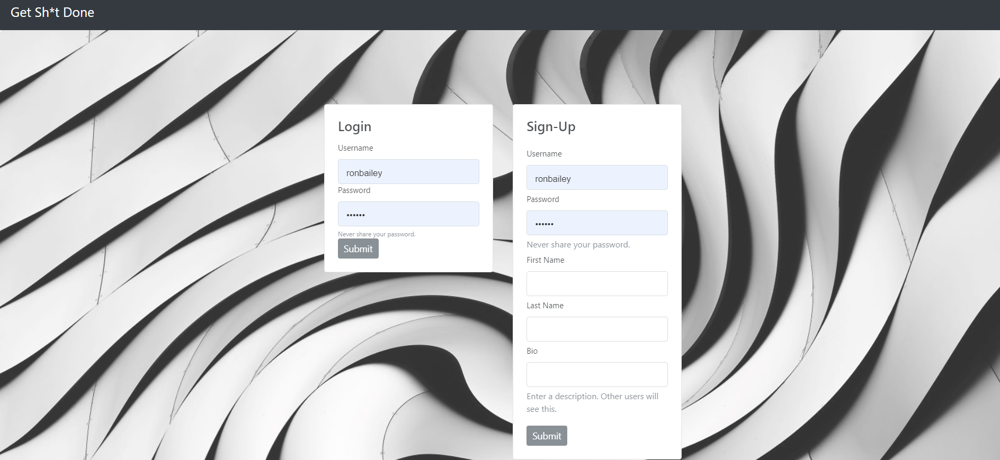
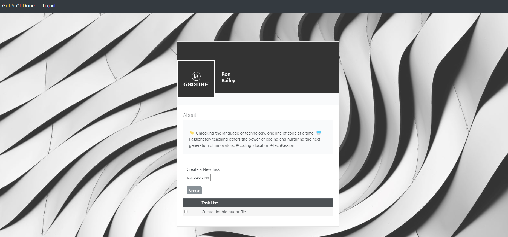

# GSDone

## Table of Contents

* [Description](#description)
* [Installation](#installation)
* [Usage](#usage)
* [Contributors](#contributors)
* [License](#license)
* [Sources](#sources)
* [Live Site](#livesite)
* [Link to Repo](#linktorepo)
* [Questions](#questions)

## Description

GSDone is a task management application for individuals that want to Get Sht Done.  This app provides a beautiful yet simple user interface.  With GSD,  users can create a user profile and manage to-do items. Users can create, check off and delete items from their list.  We know our users are busy, and thanks to our app, they can GSDone!

## Installation

To install the necessary dependencies, run the following command:

npm i 

## Usage

To use this application, run the following command:

npm start

## Contributors

Bo Salinas
Emily Arizcorreta
Sarah Squares

## License

This project is licensed under the MIT license.

## Sources

We would like to first thank our tutors and TAs for supporting us as we develop our project.  
Sample Data was generated using Mockaroo.com    
Other Sources:
W3 School
Google Bard
https://www.npmjs.com/package/express-list-endpoints
https://www.npmjs.com/package/cookie-session 

## Live Site

[GSDone](https://gsdone-2f10065746b9.herokuapp.com/)

## Link to Repo

[GSDone Repo](https://github.com/SarahSquyres/GSDone)

## Questions

If you have any questions about the repo, open an issue or contact us directly at:

[Bo Salinas](bo.salinas12@gmail.com)

[Emily Arizcorreta](rosesandbooks89@gmail.com)

[Sarah Squyres]()
